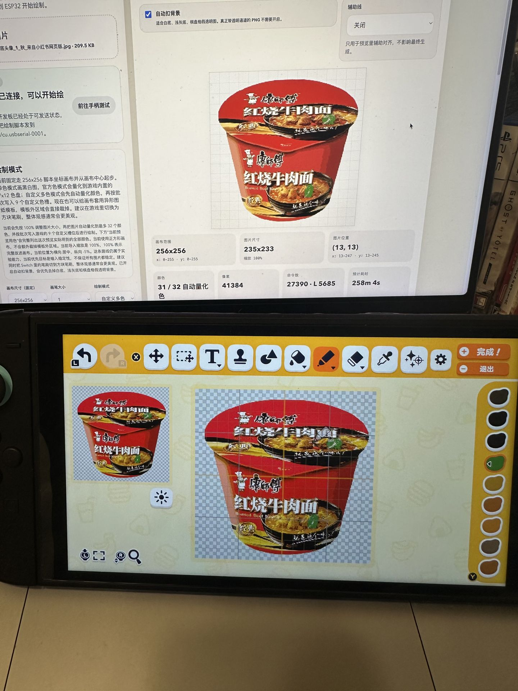
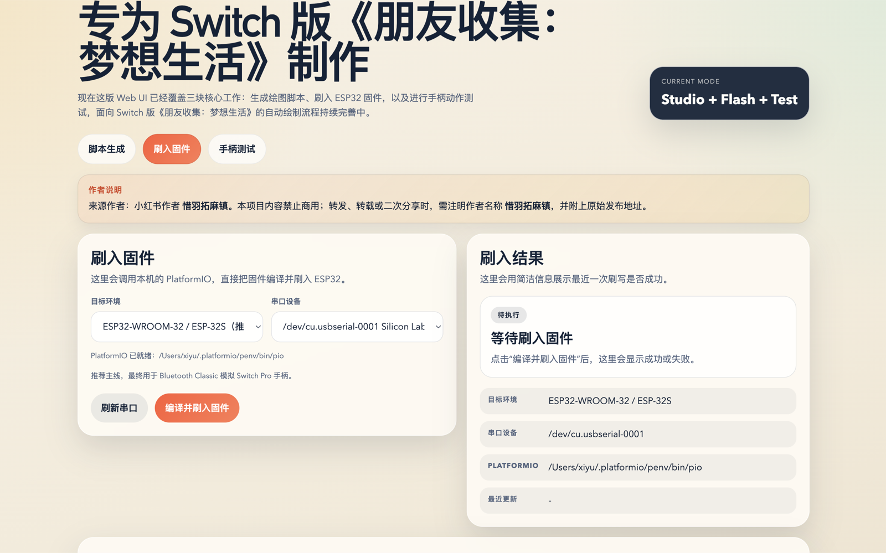
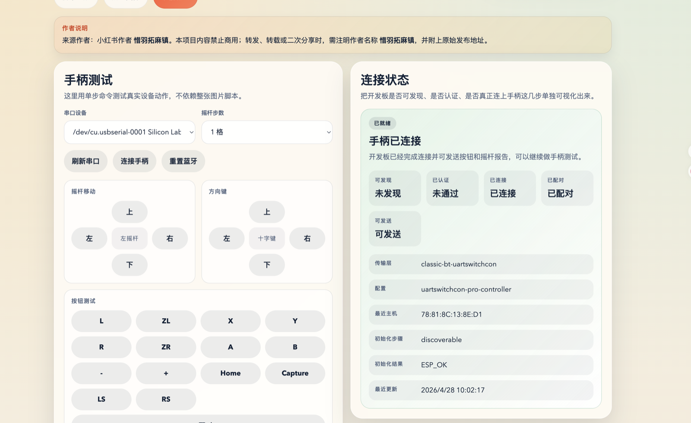

# Friend Maker

[English](README.en.md)


<p>
  <a href="docs/media/demo-video.mp4">
    
  </a>
</p>

<p>
  
  
  
</p>

`朋友制作器` 是一个面向 `Nintendo Switch《朋友收集：梦想生活》 / Tomodachi Life` 的自动绘制工作台。
它把 `刷入 ESP32 固件`、`测试手柄连接`、`调试输入时序`、`导入图片并执行绘制` 放进同一套本地界面。图片会被转换成像素预览和动作脚本，再通过 `ESP32-WROOM-32 / ESP-32S` 模拟 `Switch Pro Controller` 输入完成自动绘制。

## 项目是什么

- 面向当前实机链路的本地工作台
- 目标是把 `ESP32 固件`、`串口 ACK 发送`、`Switch 手柄链路测试` 和 `图片转绘制脚本` 串成一套闭环
- 当前默认围绕桌面端四页工作流组织：`刷入固件`、`手柄测试`、`调试测速`、`脚本生成`

## 现在能做什么

- 导入 `PNG / JPG / SVG` 图片，生成像素预览、统计信息与动作脚本
- 支持 `单色绘制`、`官方色绘制` 和 `自定义多色`
- 支持 `1 / 3 / 7 / 13 / 19 / 27` 六种画笔大小
- 支持 `256x256` 画布建模、模板裁切、辅助线预览和自动扣背景
- 支持在界面里完成 `PlatformIO` 固件刷写、串口枚举、Windows 驱动安装辅助、蓝牙连接测试与 timing 调整
- 支持暂停、继续、中断并保存恢复点；异常或重启后也能从本地恢复任务继续

## 适合谁

- 已经有 `Nintendo Switch` 和 `ESP32-WROOM-32 / ESP-32S` 开发板
- 想优先使用带界面的闭环工作流，而不是手工维护串口脚本
- 能接受当前版本仍然优先追求 `输入稳定性`，而不是极限速度或零校准上手

## 开始前提示

- 这不是 `零门槛`、`即装即用` 的纯消费级工具
- 首次使用通常仍需要完成 `ESP32` 刷写、串口或驱动识别、`Switch` 手柄配对和 `timing` 调整
- 如果你之前没有接触过 `ESP32`、`PlatformIO` 或类似链路，建议严格按文档逐步验证；首次环境准备通常需要稳定外网，并预留一定的准备与调试时间

## 当前推荐怎么用

当前公开文档默认支持两条进入路线，它们在安装方式上并列，但最终都会汇合到同一套四页工作流：

| 进入路线 | 适合场景 | 入口 |
| --- | --- | --- |
| `桌面端安装包` | 想最快开始试用 | `macOS .dmg` / `Windows x64 .exe` |
| `仓库源码路线` | 想从源码运行、调试或二次开发 | `npm install` + `npm run ui:dev` + `PlatformIO` |

启动后统一按下面顺序使用：

1. `刷入固件`：确认 `PlatformIO`、串口和固件环境正常
2. `手柄测试`：完成 `Switch` 配对、按钮和方向测试
3. `调试测速`：先调 `inputDelay`，再微调 `buttonPressDuration`
4. `脚本生成`：导图、检查预览、开始绘制，并在需要时从页面内的恢复任务继续

## 当前使用建议与限制

- 当前主线已正式支持 `单色绘制`、`官方色绘制` 和 `自定义多色`
- 第一次试用时，仍建议先用 `单色绘制` 或结构更简单的图片验证整体链路
- 当前系统固定按 `256x256` 和 `画布中心起步` 建模
- 当前第一优先级仍然是 `稳定性`，不是 `速度`
- 已知部分 `ESP32` 兼容板存在连接个体差异；如果出现频繁断链、串键或异常连发，除软件重试外，也建议一起排查数据线、供电和板子做工差异
- 保持蓝牙环境尽量干净、减少附近同时活跃的蓝牙设备，通常会更有利于连接稳定
- 某些板子在长时间运行或温度偏高时稳定性会下降；适当降温也可能改善表现

## 平台与硬件支持

### 平台

- 支持桌面端安装包：`macOS`
- 支持桌面端安装包：`Windows x64`
- 暂不支持：`Windows ARM64`
- 暂未正式支持：`Linux`

### 硬件

- 推荐开发板：`ESP32-WROOM-32 / ESP-32S`
- 常见兼容板：`ESP32 DevKitC`、`NodeMCU-32S`
- 建议选择带 `USB` 串口、可直接刷机的版本
- 当前不建议把 `ESP32-C3 / ESP32-S3 / ESP32-C6` 当作主线板型
- 需要一根可传输数据的 USB 线

## 快速开始

### 路线 A：桌面端安装包

- `macOS`：安装 `.dmg` 后直接启动 `Friend Maker`
- `Windows x64`：运行 `.exe` 安装包后直接启动 `Friend Maker`
- 首次进入 `刷入固件` 页时，如果提示缺少 `PlatformIO`，点击 `准备 PlatformIO`
- 首次准备 `PlatformIO`、下载工具链与部分依赖时，需要 `稳定联网`
- 如果应用提示缺少 `Python`，允许它下载一个供 `Friend Maker` 使用的本地运行环境即可
- `Windows` 下如果 `PlatformIO` 已就绪但没有串口，可在应用里优先安装 `CP210x` 驱动，再尝试 `CH340/CH341`

### 路线 B：仓库源码

建议先准备：

- `Node.js 20+`
- `npm 10+`
- `PlatformIO Core 6+`
- `Windows` 手动安装 `PlatformIO` 时还需要可用的 `Python 3`

常用命令：

```bash
cd /path/to/friendmaker
npm install
npm run check
npm run ui:dev
```

刷入固件：

```bash
cd /path/to/friendmaker/firmware/esp32
pio run -e esp32dev_wireless -t upload
```

如果 `pio` 不在 `PATH` 里，请改用完整路径：

- `macOS`：`~/.platformio/penv/bin/pio`
- `Windows`：`%USERPROFILE%\.platformio\penv\Scripts\pio.exe`

## 中文文档导航

- [快速上手](docs/user-trial-guide.md)：第一次试用、安装启动、刷固件、连接手柄、调 timing、开始绘制
- [排障说明](docs/troubleshooting.md)：看不到串口、准备环境失败、刷写失败、连接不稳、串键、漂移、颜色偏差
- [硬件连接说明](docs/wiring.md)：支持板型、连接方式、线材与供电注意事项
- [Windows 平台补充](docs/setup-windows.md)：驱动、`winget`、`COM` 口和 Windows 特有注意事项
- [macOS 平台补充](docs/setup-mac.md)：串口驱动、源码启动和 macOS 特有注意事项
- [开发板到手检查清单](docs/arrival-checklist.md)：板子到手后的串口确认、刷写、冒烟测试与首轮导图验证
- [开发手册](docs/development-manual.md)：当前建模、颜色路线、协议扩展与开发优先级
- [PRD](docs/PRD.md)：当前产品目标、范围、里程碑与验收标准

## 当前能力边界

- 当前绘图与恢复流程都只支持“重新进入绘图页后，从画布中心继续”这一条起点假设
- 当前不把主画布当成可以稳定“归左上角”的有边界平面
- `官方色绘制` 依赖游戏默认的 `9` 个色盘槽位起始状态
- `自动扣背景` 适合白底、浅灰底和棋盘格假透明素材，不是 AI 抠图
- 如果开始绘制后继续操作手柄或触碰屏幕，容易造成错位

## 许可证与来源

本仓库采用 **GPL-3.0-or-later** 开源协议。完整协议内容请查看 [LICENSE](LICENSE)。

`firmware/esp32` 中的 Switch 蓝牙兼容实现，引入并改写自 [UARTSwitchCon](https://github.com/nullstalgia/UARTSwitchCon) 的思路与代码路径，因此仓库采用 GPL 以保持许可证一致。

- 来源作者：小红书作者 `惜羽拓麻镇`
- 如公开转发、转载或二次分享，建议注明作者名称 `惜羽拓麻镇`
- 建议同时附上原始发布地址

## Star History

[](https://star-history.com/#zhouxiyu1997/friendmaker&Date)
